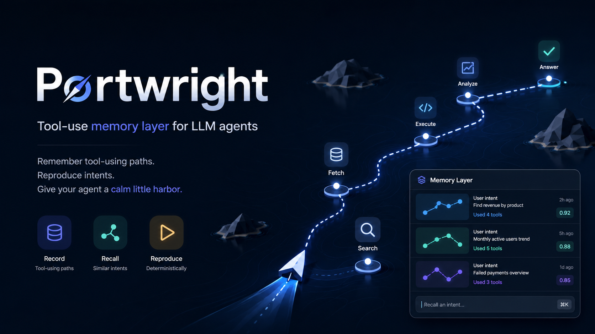

# Portwright



> A tool-use memory layer for LLM agents. Portwright helps an agent remember how external tools were connected, what failed before, and which steps still require a human.

Korean companion: [README_KR.md](README_KR.md)

## In Plain Words

**Portwright makes an agent read a short note about a tool before it touches that tool.**

It does not run the tool for you. Your agent still calls the CLI, the MCP server, or the API. Portwright is the step *before* that: it hands the agent what was already learned about this tool, on this machine, for this project.

Three kinds of notes do the work:

| Note | Lives in | Holds |
|---|---|---|
| **Procedure** | `services/<tool>.md` | The steps that are correct today, what only a human can do (`human_steps`), what the agent can do alone (`agent_can`), and what it must never ask you for |
| **Lesson** | `failures/<date>-<tool>-<symptom>.md` | What was tried, the confirmed root cause, and the corrected move |
| **Profile** | `profiles/<project>.md` | Which GitHub account, secret source, and database this directory belongs to |

On a fresh public clone, one call answers these questions (excerpt; `PW` is the clone directory):

```text
$ "$PW/bin/portwright" preflight github
READY: github
Profile: (none) no profiles defined
Procedure: services/github.md
Freshness: unknown -> verify-required (no evidence supplied (rule 3))
Tier: confirm
Active Lessons: 3
```

Which account am I on, what is the procedure, can I trust this note, and should I ask the user first.

Three promises keep it honest:

1. **Freshness never flatters.** `fresh` requires evidence. Without evidence the answer is `unknown` plus "verify first" — `unknown` is never promoted to `fresh`. Even `fresh` claims only that the versions agree, not that every step was re-proved.
2. **The tier is advice, not a gate.** Portwright reports `auto|confirm|forbid` and stops there; your Client's own permission prompt enforces it. Unmatched or unknown falls back to `confirm` — when in doubt, ask.
3. **The cache fills itself.** There is no pre-written library of 500 tools. The first time a tool is used with no note, the agent derives the current procedure from official docs and caches it. That is the whole product: knowledge that arrives by being needed.

## Why It Exists

AI agents often fail around the same external-tool chores:

- They ask the user to create or paste a token even when a connector, CLI, or MCP tool could do the work.
- They repeat an old dashboard path after the service UI has moved.
- They hit the same SDK, API, or permission error because the previous fix was never written down.

Portwright keeps those lessons in a small, readable repo. Before the agent acts, it checks the notes. If the notes are missing or stale, the agent refreshes them from current docs instead of guessing.

## What Portwright Does

Portwright has three jobs, plus a router since 2.0.0:

1. **Connect once, remember it.** Use whichever backend can actually execute the task: Composio, native MCP, a CLI, or a direct API.
2. **Verify before instructing.** If a step truly needs the user, the agent checks the current path before giving instructions.
3. **Reuse hard-won lessons.** When a tool call fails and gets fixed, the fix is saved so the next run can avoid the same failure.

Since **2.0.0**, Portwright is also a **profile router**: a `profiles/<id>.md` file binds each project directory to its GitHub account, env source, and databases, so `preflight` answers for the right account. It also reports a deterministic freshness state (`fresh|stale|unknown` — a version match proves the versions agree, not that the whole procedure is still correct) and an advisory approval tier (`auto|confirm|forbid`), and `portwright update` distributes new notes through its own guarded `git pull --ff-only` while re-checking stale ones against their local contracts. Still no gateway — the tier is advice the Client's own permission prompt enforces.

## What It Is Not

Portwright v1 is deliberately small.

- It is not a gateway.
- It is not a policy engine.
- It is not a background server.
- It is not an audit pipeline.
- It is not a pre-filled registry of every tool on the internet.

The repo stores procedures and lessons. Your agent reads them before acting.

The local CLI can be cloned and used from any directory by outside developers, company colleagues, and non-developers with an Agent. It needs no account, network, or credential. The shared public Hub (M2) is deployed but invite-only: you need an invite token from its Operator, and its latest live SECRETS/INJECTION acceptance runs are still unresolved, so treat it as optional and unproven. The separate company Hub (M3) is not approved and not available. See [Roles and scope](docs/roles-and-scope.md) for what each audience can do.

## Who It Is For

This README is written for beginners and non-developers.

You do not need to code to understand the workflow. If you can approve an occasional OAuth screen and follow a short command, that is enough. The agent should do the rest when it can.

## How It Works

```text
You ask an agent to use a tool
        |
        | resolves the Profile for this directory (2.0.0)
        v
Profile: account + env source + databases
        |
        | reads services/ and failures/ first
        v
Portwright procedure + lesson cache
        |
        | chooses the backend that can execute
        v
Composio / native MCP / CLI / direct API
        |
        v
Vercel, Notion, Supabase, GitHub, ...

`portwright update` keeps the cache current (it runs the guarded `git pull --ff-only` itself — never pull first)
```

The folders that matter most:

- `profiles/*.md` binds a project directory to its GitHub account, env source, databases, and default tier (2.0.0).
- `services/*.md` stores the current procedure for a service: what the agent can do, and what only the human can do.
- `failures/*.md` stores lessons from real failures: the root cause and the next correct move.
- `services/_private/` and `failures/_private/` hold `distributable: false` notes — personal, gitignored, read by the same catalog (2.0.0).
- `services/_private/_evidence/` caches official docs that `update` downloaded for Procedures declaring `freshness_evidence.url` — apply only, dry-run never downloads (2.0.0).

## Example

Instead of:

> "Go to the dashboard, make an API key, paste it here, then I will try again."

The agent should first ask:

1. Is there already a working connection or CLI login?
2. Is there a cached procedure in `services/`?
3. Did a previous run already record this failure in `failures/`?
4. If the user must click something, what do the current official docs say?

Only the unavoidable human step should reach the user.

## What Ships

- `install/`: setup notes, adapters, schemas, and reusable snippets
- `bin/portwright`: one interface for preflight, contract checks, memory, and Client adapters
- `skills/portwright-tool-use/`: the read-before-acting skill
- `skills/portwright-tool-memory/`: the write-carefully memory skill
- `services/`, `failures/`, and `profiles/`: cache folders that grow through use, plus `_private/` roots for personal notes

## Install

Start with [install/README.md](install/README.md).

Short version:

1. Clone this repo somewhere stable on your machine (see the install guide): `PW="$HOME/tools/portwright"`. `$PW` below means that clone directory; without `--home` or `PORTWRIGHT_HOME`, it also stores your notes.
2. Pick the Client adapter:
   - [Claude Code](install/adapters/claude-code.md)
   - [Codex](install/adapters/codex.md)
   - [Hermes](install/adapters/hermes.md)
   - [Gemini CLI](install/adapters/gemini-cli.md)
   - [Cursor](install/adapters/cursor.md)
   - [OpenCode](install/adapters/opencode.md)
   - [Oh My Pi](install/adapters/oh-my-pi.md)
   - [VS Code Copilot](install/adapters/vscode.md)
3. Run the matching install command, for example:

```sh
"$PW/bin/portwright" client install codex
```

4. Restart the Client, then verify both memory and installation:

```sh
"$PW/bin/portwright" check
"$PW/bin/portwright" client doctor codex
```

## Use

Ask your agent to use an external tool as usual. Portwright changes what the agent does before it answers or calls the tool:

1. Run `bin/portwright preflight <service-id>` — it resolves the Profile for the current directory, then returns the Procedure, active Lessons, a freshness state, and an advisory tier.
2. Read the returned Procedure and active Lessons.
3. Act through the already-connected backend when possible.
4. Ask the user only for a genuinely human-only step, such as approving OAuth.
5. If something new breaks and the root cause is confirmed, create a Lesson draft and promote it only after validation.

The local walk-through below (content home through skills) needs no network and no credentials; the optional features that do are listed in the last table. It uses made-up names (`acme-demo`, `demo-app`, `example-org`) so you can practice the whole loop; the example contents are fictional practice data, not instructions for any real tool. For a real tool, fill notes from that tool's current official documentation.

### Pick a content home

Your notes live in a **content home**: any directory you own. Without `--home` or `PORTWRIGHT_HOME`, the home is the clone itself. A separate home keeps your notes out of the code checkout, and an empty directory is enough; the schemas and bundled skills still come from the clone. `--home` overrides `PORTWRIGHT_HOME`, and a different home does not see this home's private notes.

`PW` is the clone directory from the [install guide](install/README.md) (any path; spaces are fine if quoted everywhere):

```sh
PW="$HOME/tools/portwright"
export PORTWRIGHT_HOME="$HOME/portwright-notes"   # or pass --home "$HOME/portwright-notes" to every command
mkdir -p "$PORTWRIGHT_HOME"
"$PW/bin/portwright" check                         # "0 passed, 0 failed" on an empty home is normal
```

### Preflight: cache miss, then hit

```sh
"$PW/bin/portwright" preflight acme-demo
```

On an empty home the first lines are `DERIVE REQUIRED: acme-demo`, `Procedure: (cache miss)`, `Freshness: unknown -> derive-required`, and `Tier: confirm`. This is the expected first answer, not an error (exit code 0): nothing is pre-written, so for a real tool the agent derives the current procedure from official documentation and caches it. Create a draft:

```sh
"$PW/bin/portwright" memory draft procedure acme-demo   # creates services/_drafts/acme-demo.md with <TODO ...> markers
```

A real draft has every `<TODO ...>` replaced from the official docs (the template uses Korean headings; keep them). To practice without a real tool, overwrite the draft with this fictional Procedure:

```sh
cat > "$PORTWRIGHT_HOME/services/_drafts/acme-demo.md" <<'EOF'
---
id: acme-demo
display_name: "Acme Demo (fictional)"
version_tag: "1.2"
last_verified: "2026-10-01"
endpoint:
  type: cli
  server: "acme-demo CLI (fictional)"
human_steps:
  - "없음"
agent_can:
  - "Run the fictional command: acme-demo status"
status: active
distributable: false
---

## 한 줄 요약
Practice note for a made-up tool. Not a real procedure.

## 정답 절차
1. Run `acme-demo status`.

## 하지 말 것
- Do not ask the user for a token.

## 관련 실패 기록
- 없음
EOF
```

Then validate and promote:

```sh
"$PW/bin/portwright" memory review services/_drafts/acme-demo.md    # READY TO PROMOTE or PROMOTION BLOCKED; never moves the file
"$PW/bin/portwright" memory promote services/_drafts/acme-demo.md   # PROMOTED: services/_private/acme-demo.md
"$PW/bin/portwright" preflight acme-demo                            # now READY, Procedure: services/_private/acme-demo.md
```

What the promotion guard checks (all must pass, otherwise nothing is moved):

- the draft sits directly in `services/_drafts/` or `failures/_drafts/` inside the home, and is not a symlink;
- the note satisfies its contract (`check` shows the field errors) and contains no leftover `<TODO`, `<replace`, `TODO:` or `[REDACT THIS` marker;
- no suspected secret matches `install/secret-patterns.json` (pattern-based; it does not find every possible secret, so never write credential values into a note);
- a Lesson's `## 진짜 원인` (root cause) is not still `unconfirmed`;
- an existing destination is never overwritten unless you pass `--replace`, which first saves a timestamped `.bak-` copy.

Drafts default to `distributable: false`, so they are promoted to `services/_private/` or `failures/_private/` (personal, gitignored, never exported). Only a note you deliberately mark `distributable: true` is promoted to the tracked `services/` or `failures/`. Promotion moves the draft, so promoting the same path again reports `draft file does not exist`. Running `memory draft` again for the same name prints `DRAFT EXISTS` and keeps your edits.

### Lessons

```sh
TODAY="$(date +%F)"
"$PW/bin/portwright" memory draft lesson acme-demo timeout   # failures/_drafts/$TODAY-acme-demo-timeout.md
cat > "$PORTWRIGHT_HOME/failures/_drafts/$TODAY-acme-demo-timeout.md" <<EOF
---
date: "$TODAY"
service: acme-demo
service_version: "1.2"
status: active
distributable: false
---

## 증상
The fictional status call hangs for 30 seconds.

## 진짜 원인
A made-up proxy setting pointed at a closed port.

## 해결
Unset the proxy variable for this call.

## 다음에 할 일
Check the proxy variable first when the call hangs.
EOF
"$PW/bin/portwright" memory promote "failures/_drafts/$TODAY-acme-demo-timeout.md"
```

The promote step is blocked until the root-cause section states a confirmed cause instead of `unconfirmed` (the generated draft says `unconfirmed`; the file above replaces it). A promoted Lesson is linked from the matching Procedure's related-failures section and appears under `Active Lessons` in the next preflight.

### Freshness evidence

`fresh` needs evidence. Read the current version or fetch date from the official docs, then pass it:

```sh
"$PW/bin/portwright" preflight acme-demo --evidence-version 1.2            # equals the note's version_tag -> fresh (versions agree only)
"$PW/bin/portwright" preflight acme-demo --evidence-version 1.3            # differs -> stale, derive-required
"$PW/bin/portwright" preflight acme-demo --evidence-fetched-at 2026-09-30  # on/before last_verified -> fresh; later -> unknown, verify-required
```

With no evidence the answer is `unknown` and `verify-required`. `--evidence-file <text-file>` adds an optional contradiction check that only runs when JEV (below) is available and is supporting evidence, never the verdict. A Procedure that declares `freshness_evidence.url` and `distributable: true` lets `update` download and cache the official page for later preflights.

### Optional Profiles

A Profile binds a project directory to the right GitHub account, secret source, and database. It stores references only, never values. Create `<content-home>/profiles/demo-app.md` with the complete example below (`project_path` must be an absolute path to a directory; `injector: none` is fine):

```sh
mkdir -p "$HOME/demo-project" "$PORTWRIGHT_HOME/profiles"
cat > "$PORTWRIGHT_HOME/profiles/demo-app.md" <<EOF
---
id: demo-app
display_name: Demo App
project_path: $HOME/demo-project
github_account: example-org
env_source:
  kind: none
  injector: none
databases:
  - sqlite:demo
services:
  - acme-demo
default_tier: confirm
host: any
status: active
---

## 한 줄 요약
Demo project profile (fictional).
EOF
"$PW/bin/portwright" check
cd "$HOME/demo-project" && "$PW/bin/portwright" preflight acme-demo
```

The output line becomes `Profile: demo-app (github example-org, env none, db sqlite:demo)`. The longest matching `project_path` wins; `--profile <id>` or `--cwd <dir>` overrides routing. When several profiles remain ambiguous and no JEV is available, the Profile stays `(none)` rather than guessed. A Profile's `default_tier` can only raise the advisory tier; `auto` does not lower the `confirm` returned when no rule or JEV judgment applies.

### Notes MCP and skills MCP are different servers

| Server | Command | Tools | Writes |
|---|---|---|---|
| **Notes MCP** (`portwright`) | `"$PW/bin/portwright" mcp --home "$PORTWRIGHT_HOME"` | `preflight`, `get_note`, `status` | no note edits; like the CLI, `preflight` appends a local usage record under `_local/` (gitignored; `review` reads it; deleting it breaks nothing) |
| **Skills MCP** (`portwright-skills`) | `"$PW/bin/portwright" skills serve --home "$PORTWRIGHT_HOME"` | `search_skills`, `load_skill`, `read_skill_file`, `create_skill`, `update_skill` | `create_skill` and `update_skill` write to your local skill folders |

Both are local stdio servers with no network listener. Use the generic command/arguments in the [install guide](install/README.md) and your Client's own MCP documentation to register them; `client install` does not register MCP servers. To see the Notes MCP work without a Client:

```sh
printf '%s\n' '{"jsonrpc":"2.0","id":1,"method":"initialize","params":{"protocolVersion":"2025-06-18","capabilities":{},"clientInfo":{"name":"smoke","version":"0"}}}' '{"jsonrpc":"2.0","id":2,"method":"tools/call","params":{"name":"status","arguments":{}}}' | "$PW/bin/portwright" mcp --home "$PORTWRIGHT_HOME"
```

This proves only that the server answers on stdio; it does not prove any particular Client's UI shows it.

Skills consumer basics: `"$PW/bin/portwright" skills list` and `"$PW/bin/portwright" skills get portwright-tool-use` print the two bundled skills. To expose your own skill folders through the Skills MCP, create `<content-home>/_local/skills.json` listing absolute folder paths, each containing `<skill-name>/SKILL.md` with `name` (equal to the folder name) and `description` front matter:

```json
{"local":{"mine":"/work/my-skills"}}
```

Without a configured personal Hub the Skills MCP reports `remote_unavailable` and serves local folders only. `skills status` and `skills stage` need the private work repository and are not for outside users (a public clone says so and exits with code 2).

### What needs network, a key, or an invite

| Feature | Needs | Without it |
|---|---|---|
| `check`, `preflight`, `memory`, `review`, both MCP servers | Python 3 and the clone | nothing is missing |
| JEV judgments (ambiguous Profile, risk tier, contradiction check) | optional paid `TYPESAFE_API_KEY` environment variable and network | deterministic fallback: Tier `confirm`, Freshness `unknown`, Profile unresolved when ambiguous; `status` shows `jev_mode: none` |
| `update` (new shared notes, evidence download) | the clone is a git checkout with an `origin` remote (`main` branch), and network. With a separate content home, point `--home` at the clone: `"$PW/bin/portwright" update --dry-run --home "$PW"`, then without `--dry-run`. A notes-only home has no `VERSION` or git history, so `update` exits with code 2 there | keep the notes you have |
| Shared public Hub (`hub sync`, submission tools) | an invite token from its Operator, delivered to the process through the environment variable named in `_local/hub/config.json` | local notes only; without a config `hub sync` exits with code 2 and "Hub not configured" |
| Company Hub | not approved or available | — |

Never paste credential values into commands, Client settings, notes, or URLs. See [Roles and scope](docs/roles-and-scope.md) for Hub configuration and limits.

Other commands: `"$PW/bin/portwright" browser select --candidates candidates.json --goal "<text>"` (candidate list file; uses JEV when available) and `"$PW/bin/portwright" review --days 90 --no-write` (what the cache says to fix next, counted not guessed).

Example prompts:

- "Use the cached Vercel notes before deploying this preview."
- "Before telling me how to open Notion OAuth, check the current path."
- "Use the Supabase lesson from last time so we do not repeat the same error."

## References

Portwright's v1 shape is based on the local design docs in this repo:

- [ARCHITECTURE.md](ARCHITECTURE.md): the six purposes, why there is no gateway, and the 2.0.0 profile router
- [HANDOFF.md](HANDOFF.md): the approved v1 and 2.0.0 build orders
- [CONTEXT.md](CONTEXT.md): glossary for terms such as Procedure, Lesson, and Verify-before-instruct
- [FUTURE.md](FUTURE.md): deferred gateway, policy, and audit ideas

External references:

- [Model Context Protocol](https://modelcontextprotocol.io/) for the general tool-connection pattern used by MCP clients and servers
- [OpenAI Terms of Use](https://openai.com/policies/row-terms-of-use/) for ownership and use of ChatGPT output

## Credits And Prior Art

Portwright is small because other people already solved parts of it. What was borrowed, and from where:

| Repository | What Portwright took |
|---|---|
| [changeroa/gisul](https://github.com/changeroa/gisul) | The remote serving shape: Git main → CI validation → immutable commit-pinned release → digest-verified reads → promote/rollback pointer. Portwright reuses it as the backend for serving public notes instead of building its own. |
| [tsouth89/toolport](https://github.com/tsouth89/toolport) | Keeping the always-visible tool surface small and returning references first, and the habit of measuring mechanics (schema tokens, latency) separately from model-graded quality. |
| [upstash/context7](https://github.com/upstash/context7) | Putting the tool version in the cache key: if the version differs, re-derive rather than trust. |
| [os-tack/docfresh](https://github.com/os-tack/docfresh) | Recording the upstream reference point at verification time and calling a note stale when the current reference point differs — the deterministic half of the freshness table. |
| [chopratejas/invalidate](https://github.com/chopratejas/invalidate) | The TypeSafe Jev pattern: cheap yes/no judgments over stored facts, and the rule that a question or an instruction is not evidence. |
| [mem0ai/mem0](https://github.com/mem0ai/mem0) | Supersede-on-contradiction and down-ranking instead of deleting, behind the `status: stale` model for Lessons. |
| [microsoft/playwright-mcp](https://github.com/microsoft/playwright-mcp), [browser-use/browser-use](https://github.com/browser-use/browser-use) | Serializing page elements as a numbered/`[ref=eN]` candidate list so a decision model can pick one by reference. |
| [browserbase/stagehand](https://github.com/browserbase/stagehand), [OSU-NLP-Group/Mind2Web](https://github.com/OSU-NLP-Group/Mind2Web) | Separating "collect candidates" from "choose one", and letting a cheap model narrow before an expensive one decides. |
| [calghar/gh-account-switcher](https://github.com/calghar/gh-account-switcher), [yinklylab/git-switch](https://github.com/yinklylab/git-switch) | A profile as a bundle (account + identity + keys) and a `doctor`-style self-check. |
| [jdx/mise](https://github.com/jdx/mise), [Shopify/shadowenv](https://github.com/Shopify/shadowenv) | Directory-based resolution with named overlays, and the idea that a directory must be trusted before its config is applied automatically. |
| [1mcp-app/agent](https://github.com/1mcp-app/agent) | A dotfile at the project root deciding that project's agent context. |
| [vercel-labs/skills](https://github.com/vercel-labs/skills), [numman-ali/openskills](https://github.com/numman-ali/openskills) | Recording install source and a content hash, and refusing to update when provenance is unclear. Their "wipe and re-copy" update is deliberately *not* copied, because it would destroy local notes. |
| [Composio](https://composio.dev/), [Model Context Protocol](https://modelcontextprotocol.io/) | Connection backends. Portwright is backend-agnostic: whichever one can actually execute wins. |
| Lunar MCPX, Lasso, ContextForge | Evaluated as gateway engines and deliberately not adopted. Their allow/block model has no human-in-the-loop step, which is why Portwright's tier stays advisory. See [FUTURE.md](FUTURE.md) and `docs/adr/0003`. |

No single existing project covers Portwright's combination: connection *and* usage procedures bound to a profile, a tool-use failure cache with confirmed root causes, private notes that never distribute, and client-agnostic delivery.

## License And Image Credit

MIT License — see [LICENSE](LICENSE). Copyright (c) 2026 foxion37. MIT covers both the code and the notes in `services/` and `failures/`; the cover image below follows its own credit line instead.

Cover image: ChatGPT-generated image provided by the repo owner on 2026-06-23. The image is used here as the Portwright GitHub cover. Under OpenAI's Terms of Use, OpenAI assigns its right, title, and interest in Output to the user to the extent permitted by law; users are still responsible for checking that their use is lawful and appropriate.
