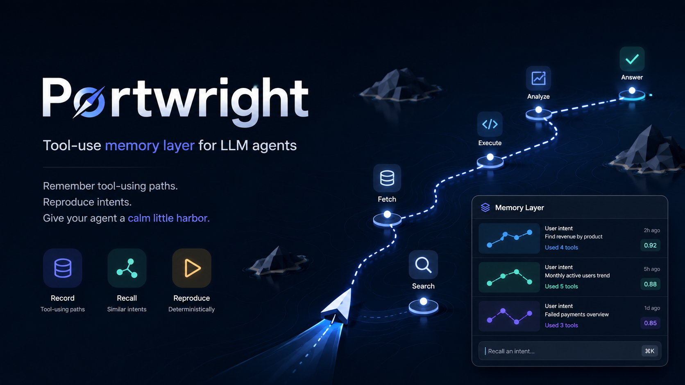

# Portwright



> LLM 에이전트를 위한 도구 사용 기억 레이어입니다. Portwright는 에이전트가 외부 도구를 어떻게 연결했는지, 무엇 때문에 실패했는지, 어떤 단계만 사람에게 맡겨야 하는지 기억하게 합니다.

영문 사본: [README.md](README.md)

## 쉬운 소개

**Portwright는 에이전트가 어떤 도구를 건드리기 직전에, 그 도구에 대한 짧은 메모를 먼저 읽게 만듭니다.**

도구를 대신 실행해 주지는 않습니다. 실행은 에이전트가 원래대로 CLI, MCP 서버, API로 합니다. Portwright는 그 앞 단계입니다. 이 컴퓨터에서, 이 프로젝트에서, 이 도구에 대해 이미 알아낸 것을 꺼내 줍니다.

메모는 세 가지입니다.

| 메모 | 위치 | 담는 것 |
|---|---|---|
| **Procedure(절차)** | `services/<도구>.md` | 지금 맞는 절차, 사람만 할 수 있는 일(`human_steps`), 에이전트가 혼자 할 수 있는 일(`agent_can`), 사용자에게 시키면 안 되는 일 |
| **Lesson(교훈)** | `failures/<날짜>-<도구>-<증상>.md` | 무엇을 시도했는지, 확인된 진짜 원인, 다음에 맞는 방법 |
| **Profile(프로파일)** | `profiles/<프로젝트>.md` | 이 디렉터리가 어느 GitHub 계정, 어느 비밀 저장소, 어느 데이터베이스에 속하는지 |

한 번 호출하면 네 가지를 한꺼번에 답합니다.

```text
$ portwright preflight google-apps-script
READY: google-apps-script
Profile: portwright (github <account>, env 1password/DEVELOPER, db -)
Procedure: services/google-apps-script.md
Freshness: fresh (version match only; procedure steps not revalidated)
Tier: confirm
Active Lessons: 0
```

지금 어느 계정인지, 절차가 무엇인지, 이 메모를 믿어도 되는지, 사용자에게 먼저 물어야 하는지입니다.

정직함을 지키는 약속이 셋 있습니다.

1. **신선도는 좋게 봐주지 않습니다.** `fresh`는 근거가 있을 때만 나옵니다. 근거가 없으면 `unknown`과 "먼저 확인하라"이고, `unknown`을 `fresh`로 올려 주지 않습니다. `fresh`도 "버전이 같다"까지만 주장하며 모든 단계를 다시 증명했다는 뜻이 아닙니다.
2. **승인 등급은 조언이지 차단이 아닙니다.** `auto|confirm|forbid`를 알려 주고 거기서 멈춥니다. 실제 차단은 각 Client의 권한 프롬프트가 합니다. 규칙에 안 맞거나 모르면 `confirm`으로 떨어집니다. 모르면 물어보라는 뜻입니다.
3. **캐시는 스스로 찹니다.** 도구 500개 절차를 미리 적어 두지 않습니다. 메모가 없는 도구를 처음 쓸 때, 에이전트가 공식 문서에서 현재 절차를 도출해 캐시합니다. 필요해서 생긴 지식만 남는 것, 그게 이 제품의 전부입니다.

## 왜 만들었나

AI 에이전트는 외부 도구를 쓸 때 같은 문제를 자주 반복합니다.

- 커넥터, CLI, MCP 도구로 처리할 수 있는데도 사용자에게 토큰을 만들거나 붙여 넣으라고 합니다.
- 서비스 화면이 바뀌었는데도 예전 대시보드 경로를 그대로 안내합니다.
- 이전에 고친 SDK, API, 권한 오류를 기록하지 않아 같은 실패를 다시 만납니다.

Portwright는 이런 교훈을 작고 읽기 쉬운 저장소에 남깁니다. 에이전트는 행동하기 전에 그 노트를 먼저 봅니다. 노트가 없거나 낡았으면 추측하지 않고 최신 문서에서 다시 확인합니다.

## Portwright가 하는 일

Portwright의 일은 세 가지이고, 2.0.0부터 라우터가 하나 더 붙었습니다.

1. **한 번 연결하고 기억합니다.** 실제로 일을 처리할 수 있는 쪽을 씁니다. Composio, 네이티브 MCP, CLI, 직접 API 중 가능한 방법이면 됩니다.
2. **지시하기 전에 확인합니다.** 정말 사람이 해야 하는 단계라면, 에이전트가 현재 경로를 확인한 뒤 안내합니다.
3. **힘들게 얻은 교훈을 다시 씁니다.** 도구 호출이 실패했고 해결했다면, 다음 실행에서 같은 실패를 피하도록 고친 방법을 저장합니다.

**2.0.0**부터 Portwright는 **프로파일 라우터**이기도 합니다. `profiles/<id>.md`가 프로젝트 디렉터리를 GitHub 계정, env 소스, 데이터베이스에 묶어 `preflight`가 올바른 계정으로 답하게 합니다. 결정적 신선도 상태(`fresh|stale|unknown`; 버전 일치는 버전이 같다는 증거이지 절차 전체가 여전히 정확하다는 증명이 아닙니다)와 조언용 승인 tier(`auto|confirm|forbid`)도 보고하고, `portwright update`가 자체 가드된 `git pull --ff-only`로 새 노트를 배포하면서 낡은 노트를 로컬 계약에 대고 다시 검사합니다. 게이트웨이는 여전히 없습니다. tier는 Client 자체 권한 프롬프트가 강제하는 조언입니다.

## 아닌 것

Portwright v1은 일부러 작게 유지합니다.

- 게이트웨이가 아닙니다.
- 정책 엔진이 아닙니다.
- 백그라운드 서버가 아닙니다.
- 감사 파이프라인이 아닙니다.
- 인터넷의 모든 도구를 미리 채워 둔 등록소가 아닙니다.

이 저장소는 절차와 교훈을 보관합니다. 에이전트는 행동하기 전에 그것을 읽습니다.

외부 개발자, 회사 동료, 비개발자도 임의의 경로에 복제한 로컬 CLI를 에이전트와 함께 사용할 수 있습니다. 공유 공개 Hub(M2)와 별도 회사 Hub(M3)는 계획 단계이며 v2.1.0에는 아직 없습니다. 사용자별 역할과 범위는 [역할과 범위](docs/roles-and-scope_KR.md)를 참고하세요.

## 누구를 위한 것인가

이 README는 초보자와 비개발자를 위해 썼습니다.

코드를 몰라도 흐름을 이해할 수 있습니다. 가끔 OAuth 승인 화면을 눌러 주고 짧은 명령어를 따라 할 수 있으면 충분합니다. 그 밖의 일은 가능하면 에이전트가 직접 해야 합니다.

## 작동 방식

```text
사용자가 에이전트에게 도구 사용을 요청
        |
        | 이 디렉터리의 Profile을 먼저 정함 (2.0.0)
        v
Profile: 계정 + env 소스 + 데이터베이스
        |
        | services/와 failures/를 먼저 읽음
        v
Portwright 절차 + 교훈 캐시
        |
        | 실제 실행 가능한 백엔드를 고름
        v
Composio / 네이티브 MCP / CLI / 직접 API
        |
        v
Vercel, Notion, Supabase, GitHub, ...

`portwright update`가 캐시를 최신으로 유지(가드된 `git pull --ff-only`를 직접 수행하므로 먼저 pull 하지 않음)
```

가장 중요한 폴더는 이렇습니다.

- `profiles/*.md`는 프로젝트 디렉터리를 GitHub 계정, env 소스, 데이터베이스, 기본 tier에 묶습니다 (2.0.0).
- `services/*.md`는 서비스별 현재 절차를 저장합니다. 에이전트가 할 수 있는 일과 사람만 할 수 있는 일을 나눠 둡니다.
- `failures/*.md`는 실제 실패에서 얻은 교훈을 저장합니다. 진짜 원인과 다음에 해야 할 올바른 행동을 적습니다.
- `services/_private/`와 `failures/_private/`는 `distributable: false` 노트를 둡니다. 개인용이고 gitignore되며 같은 카탈로그가 읽습니다 (2.0.0).
- `services/_private/_evidence/`는 `freshness_evidence.url`을 선언한 Procedure의 공식 문서를 `update`가 내려받아 캐시한 곳입니다. apply 때만 내려받고 dry-run은 다운로드하지 않습니다 (2.0.0).

## 예시

예전 방식은 이렇습니다.

> "대시보드에 들어가서 API 키를 만들고 여기에 붙여 넣어 주세요. 그다음 다시 시도하겠습니다."

Portwright를 쓰는 에이전트는 먼저 이렇게 확인해야 합니다.

1. 이미 작동하는 연결이나 CLI 로그인이 있는가?
2. `services/`에 캐시된 절차가 있는가?
3. 이전 실행이 같은 실패를 `failures/`에 기록했는가?
4. 사용자가 꼭 눌러야 하는 단계라면, 현재 공식 문서의 경로는 무엇인가?

사용자에게는 정말 사람만 할 수 있는 단계만 전달해야 합니다.

## 들어있는 것

- `install/`: 설치 노트, 어댑터, 스키마, 재사용 스니펫
- `bin/portwright`: preflight, 계약 검사, Memory, Client adapter를 다루는 하나의 명령
- `skills/portwright-tool-use/`: 행동 전 먼저 읽는 스킬
- `skills/portwright-tool-memory/`: 조심스럽게 기억을 남기는 스킬
- `services/`, `failures/`, `profiles/`: 사용하면서 자라는 캐시 폴더와 개인 노트용 `_private/` 루트

## 설치 방법

먼저 [install/README.md](install/README.md)를 봅니다.

짧은 버전은 이렇습니다.

1. 이 저장소를 내 컴퓨터의 안정적인 위치에 clone합니다. 아래 `<portwright>`는 clone한 디렉터리입니다. `--home`이나 `PORTWRIGHT_HOME`을 지정하지 않으면 노트도 이곳에 저장합니다.
2. 사용하는 Client에 맞는 adapter를 고릅니다.
   - [Claude Code](install/adapters/claude-code.md)
   - [Codex](install/adapters/codex.md)
   - [Hermes](install/adapters/hermes.md)
   - [Gemini CLI](install/adapters/gemini-cli.md)
   - [Cursor](install/adapters/cursor.md)
   - [OpenCode](install/adapters/opencode.md)
   - [Oh My Pi](install/adapters/oh-my-pi.md)
   - [VS Code Copilot](install/adapters/vscode.md)
3. 맞는 설치 명령을 실행합니다. Codex라면 다음과 같습니다.

```sh
<portwright>/bin/portwright client install codex
```

4. Client를 다시 시작하고 Memory와 설치 상태를 확인합니다.

```sh
<portwright>/bin/portwright check
<portwright>/bin/portwright client doctor codex
```

## 사용 방법

평소처럼 에이전트에게 외부 도구를 쓰라고 요청하면 됩니다. Portwright는 에이전트가 답하거나 도구를 호출하기 전에 할 일을 바꿉니다.

1. `bin/portwright preflight <service-id>`를 실행합니다. 현재 디렉터리의 Profile을 먼저 정한 뒤 Procedure, active Lesson, 신선도 상태, 조언용 tier를 돌려줍니다.
2. 명령이 돌려준 Procedure와 active Lesson을 읽습니다.
3. 이미 연결된 백엔드가 있으면 그쪽으로 직접 처리합니다.
4. OAuth 승인처럼 사람만 할 수 있는 단계만 사용자에게 묻습니다.
5. 새 Failure의 root cause를 확인했다면 Lesson draft를 만듭니다. 검사를
   통과한 draft만 정식 Memory로 옮깁니다.

```sh
bin/portwright memory draft lesson <service-id> <slug>
bin/portwright memory promote <draft-path>
```

2.0.0 명령:

```sh
bin/portwright preflight <service-id> [--intent call|instruct|recover] [--profile <id>] [--json]
bin/portwright browser select --candidates candidates.json --goal "<text>" [--json]   # 파일에 후보 목록
bin/portwright update --dry-run --json   # 미리보기. update 가 git pull --ff-only 를 직접 수행하므로 pull 을 먼저 하지 않는다
bin/portwright update
```

```sh
bin/portwright review --days 90   # 캐시가 말하는 다음 개선점 (추측이 아니라 카운팅)
```

예시는 이렇게 말할 수 있습니다.

- "이 preview를 배포하기 전에 Vercel 캐시 노트부터 확인해줘."
- "Notion OAuth 여는 법을 알려주기 전에 현재 경로를 먼저 확인해줘."
- "지난번 Supabase 교훈을 보고 같은 오류를 반복하지 않게 해줘."

## 참고 자료

Portwright v1의 구조는 이 저장소 안의 설계 문서를 기준으로 합니다.

- [ARCHITECTURE.md](ARCHITECTURE.md): 여섯 목적, 게이트웨이가 없는 이유, 2.0.0 프로파일 라우터
- [HANDOFF.md](HANDOFF.md): 승인된 v1과 2.0.0 작업 순서
- [CONTEXT.md](CONTEXT.md): Procedure, Lesson, Verify-before-instruct 같은 용어 설명
- [FUTURE.md](FUTURE.md): 나중으로 미룬 게이트웨이, 정책, 감사 아이디어

외부 참고 자료:

- [Model Context Protocol](https://modelcontextprotocol.io/): MCP 클라이언트와 서버가 도구를 연결하는 기본 패턴
- [OpenAI Terms of Use](https://openai.com/policies/row-terms-of-use/): ChatGPT 출력물의 소유권과 사용 조건

## 참고한 저장소와 선행 연구

Portwright가 작은 이유는, 부분 부분을 이미 남들이 풀어 놨기 때문입니다. 무엇을 어디서 가져왔는지 적습니다.

| 저장소 | 가져온 것 |
|---|---|
| [changeroa/gisul](https://github.com/changeroa/gisul) | 원격 제공 구조. Git main → CI 검증 → 커밋에 고정된 불변 릴리스 → 해시 검증 읽기 → 승격·롤백 포인터. 직접 만들지 않고 공개 노트 제공 백엔드로 그대로 재사용합니다. |
| [tsouth89/toolport](https://github.com/tsouth89/toolport) | 항상 노출되는 도구 표면을 작게 두고 참조부터 돌려주는 방식, 그리고 기계적 측정(스키마 토큰·지연)과 모델 품질 평가를 분리하는 습관. |
| [upstash/context7](https://github.com/upstash/context7) | 캐시 키에 도구 버전을 박아 두고, 버전이 다르면 믿지 말고 다시 도출한다는 원칙. |
| [os-tack/docfresh](https://github.com/os-tack/docfresh) | 검증 시점의 upstream 기준점을 기록하고 지금 기준점과 다르면 stale로 보는 방식. 신선도 판정표의 결정적 절반입니다. |
| [chopratejas/invalidate](https://github.com/chopratejas/invalidate) | TypeSafe Jev 패턴. 저장된 사실에 값싼 예·아니오 판정을 걸고, 질문이나 지시문은 근거로 치지 않는 규칙. |
| [mem0ai/mem0](https://github.com/mem0ai/mem0) | 모순이 생기면 지우지 말고 덮어쓰거나 순위를 낮추는 방식. Lesson의 `status: stale` 모델이 여기서 왔습니다. |
| [microsoft/playwright-mcp](https://github.com/microsoft/playwright-mcp), [browser-use/browser-use](https://github.com/browser-use/browser-use) | 화면 요소를 번호나 `[ref=eN]` 후보 목록으로 직렬화해 판단 모델이 참조로 하나를 고르게 하는 형식. |
| [browserbase/stagehand](https://github.com/browserbase/stagehand), [OSU-NLP-Group/Mind2Web](https://github.com/OSU-NLP-Group/Mind2Web) | "후보 모으기"와 "하나 고르기"를 분리하고, 값싼 모델이 먼저 추리게 하는 2단계 구조. |
| [calghar/gh-account-switcher](https://github.com/calghar/gh-account-switcher), [yinklylab/git-switch](https://github.com/yinklylab/git-switch) | 프로파일을 계정·identity·키의 묶음으로 보는 정의와 `doctor` 식 자체 점검. |
| [jdx/mise](https://github.com/jdx/mise), [Shopify/shadowenv](https://github.com/Shopify/shadowenv) | 디렉터리 기반 해상도와 명명된 오버레이, 그리고 설정을 자동 적용하기 전에 그 디렉터리를 신뢰하는지 먼저 따지는 모델. |
| [1mcp-app/agent](https://github.com/1mcp-app/agent) | 프로젝트 루트의 dotfile이 그 프로젝트의 에이전트 컨텍스트를 결정한다는 패턴. |
| [vercel-labs/skills](https://github.com/vercel-labs/skills), [numman-ali/openskills](https://github.com/numman-ali/openskills) | 설치 출처와 콘텐츠 해시를 기록하고, 출처가 불분명하면 갱신하지 않는 계약. 다만 "비우고 다시 복사"하는 갱신 방식은 로컬 노트를 지우기 때문에 일부러 가져오지 않았습니다. |
| [Composio](https://composio.dev/), [Model Context Protocol](https://modelcontextprotocol.io/) | 연결 백엔드. Portwright는 백엔드에 종속되지 않고, 실제로 실행할 수 있는 쪽을 씁니다. |
| Lunar MCPX, Lasso, ContextForge | 게이트웨이 엔진 후보로 검토한 뒤 일부러 채택하지 않았습니다. allow/block 모델에는 사람이 개입하는 단계가 없고, 그래서 Portwright의 등급은 조언으로 남았습니다. [FUTURE.md](FUTURE.md)와 `docs/adr/0003` 참고. |

이 조합 전체를 덮는 기존 프로젝트는 없습니다. 연결과 사용 절차를 프로파일에 묶고, 원인이 확인된 실패 캐시를 쌓고, 개인 노트는 절대 배포하지 않으며, Client에 종속되지 않고 전달한다는 조합입니다.

## 라이선스와 이미지 출처

MIT 라이선스입니다. 전문은 [LICENSE](LICENSE)에 있습니다. Copyright (c) 2026 foxion37. MIT는 코드와 `services/`·`failures/` 메모 모두에 적용되며, 아래 커버 이미지만 별도 출처 표기를 따릅니다.

커버 이미지: 저장소 소유자가 2026-06-23에 제공한 ChatGPT 생성 이미지입니다. Portwright의 GitHub 커버로 사용합니다. OpenAI 이용약관은 법이 허용하는 범위에서 Output에 대한 OpenAI의 권리, 소유권, 이익을 사용자에게 양도한다고 설명합니다. 다만 사용자는 해당 출력물을 쓰는 일이 법과 용도에 맞는지 직접 확인해야 합니다.
